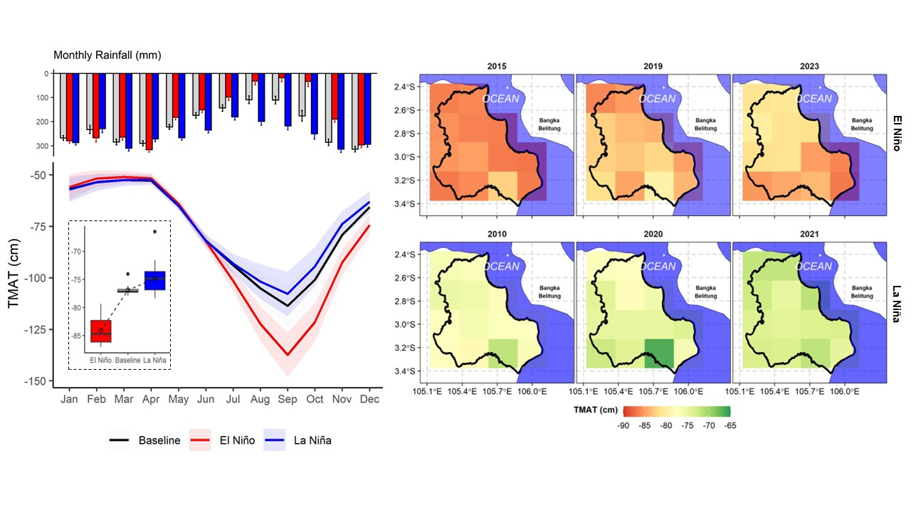
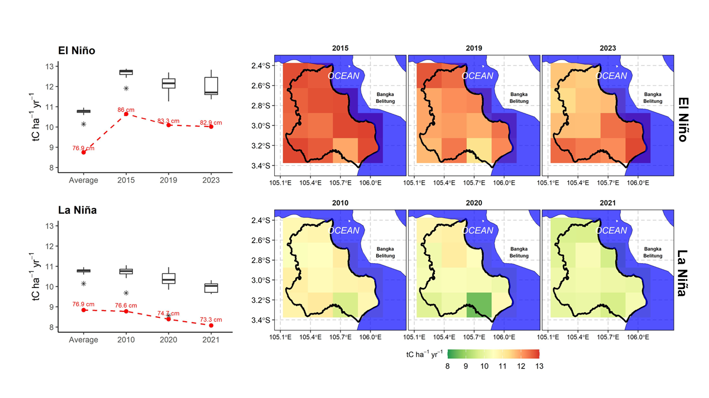
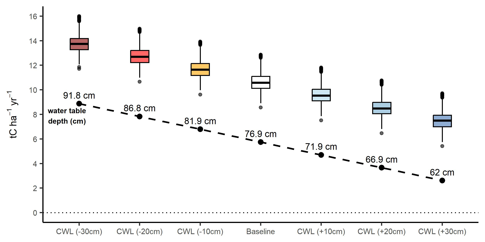

---
# A-10-cm-Fix-Rewetting-to-Save-Peat-Carbon
---

## Abstract
Indonesia’s tropical peatlands store nearly half of the world’s tropical peat carbon but are highly sensitive to water table fluctuations, making them vulnerable to climate variability and drainage. This study quantifies the impacts of El Niño–Southern Oscillation (ENSO) events and canal water level (CWL) management on peat water table depth (WTD) and carbon emissions in Ogan Komering Ilir, South Sumatra. Using daily ERA5 rainfall and temperature data (2001–2024), we simulated WTD at high spatial and temporal resolution and assessed carbon loss under different hydrological scenarios. El Niño years deepened WTD by ~10 cm, increasing annual peat carbon loss by ~27% compared to baseline conditions. Simulated rewetting, achieved by maintaining CWL +10 cm during dry seasons, reduced carbon loss by approximately 1.0 tC ha⁻¹ yr⁻¹ (~3.67 tCO₂ ha⁻¹ yr⁻¹), delivering potential economic benefits of USD 13.4–257.8 million annually, depending on carbon market prices. These findings demonstrate that modest, targeted rewetting is an effective and cost-efficient Nature-Based Solution (NbS) to mitigate greenhouse gas emissions, enhance peatland resilience, and support climate commitments in Southeast Asia.

## Water Table Depth

---

## Carbon Emissions: ENSO Years

- El Niño events deepened WTD by **~5–9 cm**, increasing peat carbon losses by up to **~12.87 tC ha⁻¹ yr⁻¹ (~27%)**.  
- In contrast, La Niña years maintained shallower WTDs, corresponding to reduced emission rates.  
- These findings highlight that **El Niño-induced drying accelerates peat carbon loss** across tropical peatlands.

---

## Scenario: Canal Water Level (CWL) Rewetting

**Findings**

- Maintaining **CWL +10 cm during dry seasons** reduced mean peat carbon loss by **~1.0 tC ha⁻¹ yr⁻¹ (~3.67 tCO₂ ha⁻¹ yr⁻¹)**.  
- At the landscape scale (~1 million ha), this equates to **~3.68 MtCO₂ yr⁻¹ avoided**.  
- **Economic valuation:**  
  - USD 13.4 million (IDX secondary market)  
  - USD 257.8 million annually (EU ETS spot price)  

These results demonstrate that **small hydrological adjustments** can yield **large-scale climate mitigation and financial benefits**.

---

